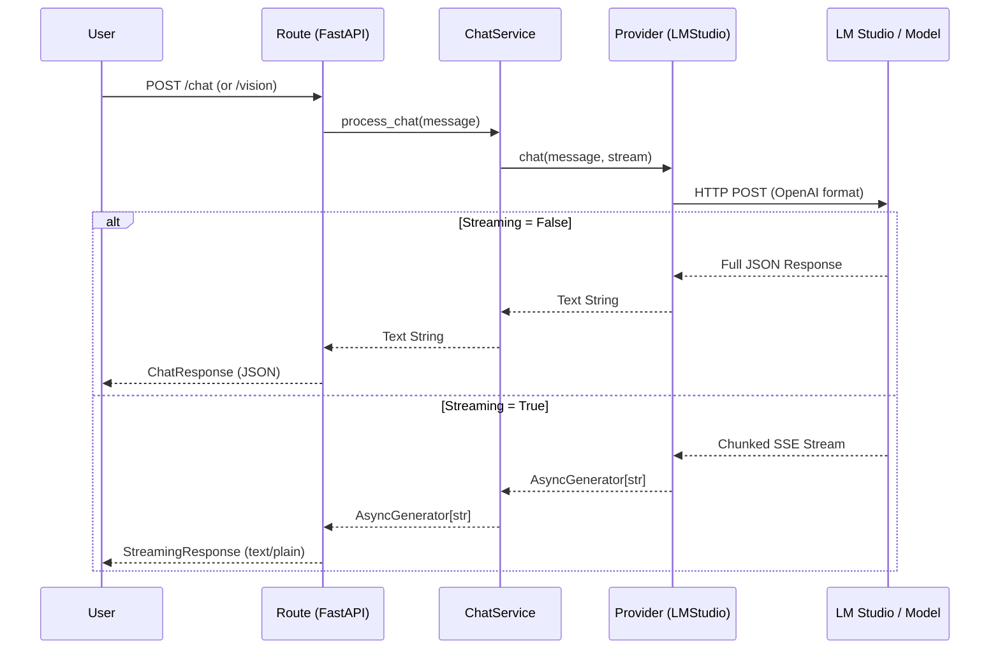

# LLM Service Gateway

Welcome to the **LLM Service Gateway**! This service acts as a simple, scalable, and highly adaptable middleware between your applications and Large Language Models (LLMs). Right now, it's configured to talk to a local LM Studio instance, but the architecture is specifically designed to let you plug and play any other provider (like vLLM, OpenAI, or Anthropic) in the future without touching the core routing logic.

##  Architecture Overview

The core philosophy of this project is **separation of concerns**. We strictly prevent the API routes from directly communicating with the LLMs. Instead, data flows through a pipeline of abstractions.

Here is a visual representation of how a request moves through the system:



##  Project Structure

```text
llm_service/
├── main.py                 # FastAPI application entry point
├── requirements.txt        # Project dependencies
├── core/
│   └── config.py           # Environment variables (LMSTUDIO_URL, MODEL)
├── providers/
│   ├── base.py             # Abstract Base Class defining the provider contract
│   └── lmstudio.py         # Concrete implementation for LM Studio
├── routes/
│   ├── chat.py             # API endpoints (/chat, /vision, /models)
│   └── health.py           # API endpoint (/health)
├── schemas/
│   ├── request.py          # Pydantic models for incoming requests
│   └── response.py         # Pydantic models for outgoing JSON responses
└── services/
    └── chat_service.py     # Business logic, image conversion, and provider orchestration
```

##  Deep Dive into the Layers

### 1. Routes (`routes/`)
This is the front door of the service. Built entirely with FastAPI, the routes handle HTTP requests, validate incoming payloads using our Schemas, and return HTTP responses. 
*Note: The routes never instantiate the LLM provider themselves. They rely on FastAPI's Dependency Injection (`Depends()`) to get the correct service.*

### 2. Services (`services/`)
The brain of the operation. The `ChatService` sits between the Routes and the Providers. If an image is uploaded to the `/vision` endpoint, this service converts the binary data into a base64 string before handing it off to the provider. It ensures that the Routes don't have to worry about data transformations.

### 3. Providers (`providers/`)
This is where the magic happens. 
- **`base.py`** defines an unbreakable contract (an Abstract Base Class). Every provider *must* implement `chat`, `vision`, and `models`.
- **`lmstudio.py`** is our active provider. It uses `httpx.AsyncClient` to asynchronously send requests to your local LM Studio. It natively supports parsing Server-Sent Events (SSE) to yield live text streams token by token.

### 4. Schemas (`schemas/`)
We use Pydantic models to strictly type our incoming and outgoing JSON. This gives us automatic validation and beautiful, self-documenting Swagger UI pages.

---

## 🛠 Prerequisites (Local Models)

Currently, this gateway is configured to proxy requests to **LM Studio** running locally. Before starting this service, ensure you have:
1. **LM Studio** installed and open on your machine.
2. A model downloaded and loaded into LM Studio (e.g., `qwen3-vl-8b-instruct` if you want to use the vision capabilities).
3. The **Local Server** started in LM Studio (typically running on port `1234`).

---

##  How to Run

1. **Set up the virtual environment:**
   ```bash
   python -m venv venv
   # Windows:
   .\venv\Scripts\activate
   # Mac/Linux:
   source venv/bin/activate
   ```

2. **Install dependencies:**
   ```bash
   pip install -r llm_service/requirements.txt
   ```

3. **Start the server:**
   Ensure you run the module correctly from the root directory (one level above `llm_service`):
   ```bash
   uvicorn llm_service.main:app --host 0.0.0.0 --port 8000 --reload
   ```

---

##  Testing the API

Once the server is running, you can test it visually at [http://localhost:8000/docs](http://localhost:8000/docs). 

Here are some handy `curl` commands:

**Standard Chat:**
```bash
curl -X POST "http://localhost:8000/chat" \
     -H "Content-Type: application/json" \
     -d '{"message": "What is Python?"}'
```

**Live Streaming Chat:**
*(The `-N` flag tells curl not to buffer the output, so you see the stream live!)*
```bash
curl -N -X POST "http://localhost:8000/chat" \
     -H "Content-Type: application/json" \
     -d '{"message": "Write a short poem about coding", "stream": true}'
```

**Vision Inference:**
```bash
curl -X POST "http://localhost:8000/vision" \
     -H "Content-Type: multipart/form-data" \
     -F "message=Describe this image." \
     -F "stream=false" \
     -F "image=@/path/to/your/image.jpg"
```

---

## 🌐 Using this API in Other Projects

The real power of this gateway is that it acts as an **abstraction layer**. You can have multiple other projects (websites, discord bots, scripts) all using your local LLM by simply sending HTTP requests to this service, exactly as if you were calling the official OpenAI API. You never need to write messy base64 image encoders in your client apps!

Here is how you would call this service from another Python project using the `requests` library.

### Basic Chat Request
```python
import requests

API_URL = "http://localhost:8000/chat"
payload = {
    "message": "Summarize the plot of the Matrix in one sentence.",
    "stream": False
}

response = requests.post(API_URL, json=payload)
print(response.json()["response"])
```

### Vision Request (Image Upload)
You don't need to convert your image to Base64 in your client app. Just attach the raw file!

```python
import requests

API_URL = "http://localhost:8000/vision"

# 1. Open the image file in binary reading mode
with open("my_photo.jpg", "rb") as image_file:
    files = {"image": image_file}
    data = {
        "message": "Describe exactly what you see in this picture.",
        "stream": False
    }

    # 2. Fire it off to your LLM Gateway!
    response = requests.post(API_URL, data=data, files=files)

print(response.json()["response"])
```
